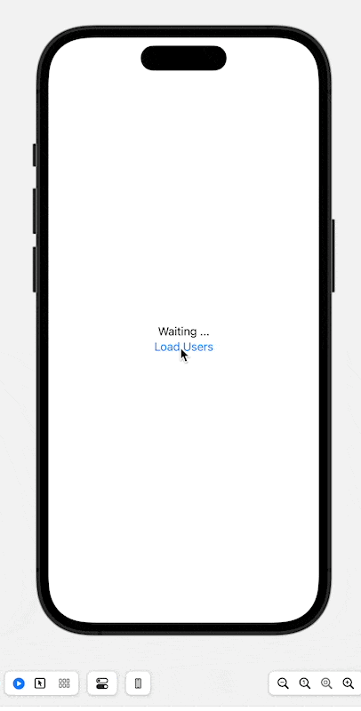

# Type énuméré

## Définition
Une énumération  en programmation est un type de données qui permet de définir un ensemble fini de valeurs nommées.   
Cela facilite la représentation de concepts avec un ensemble restreint de choix prédéfinis.   
En général, une énumération est définie en tant qu'une liste de constantes nommées, appelées membres de l'énumération, qui représentent les différentes valeurs possibles.   
Par exemple, en **swift** :
```swift
enum Couleur {
	case ROUGE
	case VERT
	case BLEU
}
```
Dans cet exemple, l'énumération « Couleur » est définie avec trois membres : ROUGE, VERT et BLEU. Ces membres peuvent ensuite être utilisés pour déclarer des variables ou effectuer des comparaisons dans le code.
## Utilisation d’un Enum simple
Soit l’énumération suivante, qui représente les jours de la semaine : 
```swift
enum DaysOfWeek {
    case sunday
    case monday
    case tuesday
    case wednesday
    case thursday
    case friday
    case saturday
}
```
## Utilisation d’une énumération dans une fonction
### Exemple 1 - Fonction _whatToDo_
Imaginons une fonction **whatToDo** qui permet de savoir que faire tel jour, cette fonction aura pour signature :
```swift
func whatToDo(day: DaysOfWeek) -> String {
 // TODO CODE
}
```
Maintenant, nous allons faire un switch sur la variable _day_: 
```swift
func whatToDo(day: DaysOfWeek) -> String {
    switch day {
        case .sunday:
            return "Go to church"
        case .monday:
            return "Go to work"
        case .tuesday:
            return "Back to work"
        case .wednesday:
            return "go to gym"
        case .thursday:
            return "One more day"
        case .friday:
            return "last day"
        case .saturday:
            return "go shoping"
    }
}
```
L’utilisation est alors triviale : 
```swift
print(whatToDo(day: .saturday))
```
Cela nous donnera en sortie : 
```swift
go shoping
```
Comme prévu.
### Exemple 2 - Fonction _isWeekendDay_
Cette fois, nous allons créer une fonction **isWeekendDay** qui permettra de savoir si un jour fait partie du weekend ou non.   
La signature de cette fonction sera :
```swift
func isItWeekend(day: DaysOfWeek) -> Bool {
    switch day {
        case .saturday, .sunday:
            return true
        default:
            return false
    }
}
```
Ici le paramètre est encore un paramètre du type DaysOfWeek, on switch sur la variable day et si c’est un samedi ou un dimanche alors on retourne true.  
Ce que nous pouvons tester comme ceci :
```swift
print(isItWeekend(day: .friday).description) // Output: false
print(isItWeekend(day: .sunday).description) // Output: true
```
## rawValue
Maintenant, imaginons que nous souhaitions accéder à la valeur de l’énumération, par exemple, on peut écrire :
```swift
print(DaysOfWeek.friday) 
```
La sortie sera :
```swift
friday
```
Mais, maintenant, imaginons une seconde énumération :
```swift
enum Numbers {
    case one        
    case two
    case three
    case four
    case five
}
```
Cette fois si on écrit :
```swift
print(Numbers.four)
```
Ainsi la sortie sera : 
```swift
four
```
Ce qui ne sert pas à grand-chose.
Alors, nous allons reprendre la première énumération et la faire se conformer à **String** et attribuer à chaque cas une valeur :
```swift
enum DaysOfWeek: String {
    case sunday     = "Sun"
    case monday     = "Mon"
    case tuesday    = "Tue"
    case wednesday  = "Wed"
    case thursday   = "Thur"
    case friday     = "Fri"
    case saturday   = "Sat"
}
```
Cette fois si on utilise la même méthode que précédemment, mais en appelant la propriété **rawValue**:
```swift
print(DaysOfWeek.friday.rawValue) 
```
La sortie sera cette fois : 
```swift
Fri
```
Ainsi ou l’utilité devient plus évidente avec la seconde énumération **Numbers** et faisons là se conformer à **Int**:
```swift
enum Numbers: Int {
    case one
    case two
    case three
    case four
    case five
}
```
Cette fois si on appelle la propriété **rawValue** :
```swift
print(Numbers.four.rawValue)
```
On Obtient en sortie : `3`
Maintenant, modifions un peu notre énumération en ajoutant au premier cas une valeur de type Int, juste sur la première valeur, car les autres valeurs seront autoincrémentées : 
```swift
enum Numbers: Int {
    case one = 1
    case two
    case three
    case four
    case five
}
```
Cette fois :
```swift
print(Numbers.four.rawValue)
```
Retournera : `4`
Évidemment, si on modifie la valeur initiale à -1 par exemple, alors la sortie sera : `2`
## Enum et Collections
Il est tout à fait possible de parcourir une énumération comme une collection, pour ce faire, vérifier que l’énumération se conforme à **CaseIterable**, notre première énumération devient ainsi :
```swift
enum DaysOfWeek: String, CaseIterable {
    case sunday     = "Sun"
    case monday     = "Mon"
    case tuesday    = "Tue"
    case wednesday  = "Wed"
    case thursday   = "Thur"
    case friday     = "Fri"
    case saturday   = "Sat"
}
```
Maintenant, nous pouvons appliquer les opérations dédiées aux collections à nos énumérations.
### Exemple 1
Imaginons que nous souhaitions mettre en majuscule toutes les **rawValue** et les afficher :
```swift
DaysOfWeek
    .allCases
    .map { $0.rawValue.uppercased() }
    .forEach { print($0) }
```
Ce qui nous donne en sortie : 
```swift
SUN
MON
TUE
WED
THUR
FRI
SAT
```
### Exemple 2
Nous voulons parcourir les valeurs de l’énumération et afficher si ce jour fait partie du weekend ou non :
```swift
DaysOfWeek
    .allCases
    .map {
        switch $0 {
            case .saturday, .sunday:
                print("\($0) is weekend")
            default:
                print("\($0) is workday")
        }
    }
```
Ce qui propose en sortie :
```bash
sunday is weekend
monday is workday
tuesday is workday
wednesday is workday
thursday is workday
friday is workday
saturday is weekend
```

## Valeurs Associées
De plus, on peut ajouter des valeurs associées aux énumérations. 
### Définition
Les valeurs associées dans une énumération (`enum`) en Swift permettent d'attribuer des données spécifiques à chaque cas de l'énumération.   
Chaque cas peut être associé à une ou plusieurs valeurs, qui peuvent être de types différents.   
Cela permet de représenter des situations où chaque cas de l'énumération nécessite des informations supplémentaires pour être complètement défini.
Par exemple : 
```swift
enum SimpleEnum {
    case name(String)
    case age(Int)
}
```
### Exemple simple
```swift
enum Media {
    case book(title: String, author: String)
    case movie(title: String, director: String)
    case song(title: String, artist: String)
}

let myBook = Media.book(title: "The Great Gatsby", author: "F. Scott Fitzgerald")
let myMovie = Media.movie(title: "Inception", director: "Christopher Nolan")
let mySong = Media.song(title: "Bohemian Rhapsody", artist: "Queen")

switch myBook {
case .book(let title, let author):
    print("Book: \(title) by \(author)")
case .movie(let title, let director):
    print("Movie: \(title) directed by \(director)")
case .song(let title, let artist):
    print("Song: \(title) by \(artist)")
}

```
### Errors
Maintenant passons à un exemple plus concret à savoir la gestion des erreurs, pour commencer simplement examinons le cas de la division et surtout de la division par 0.
Nous allons utiliser le type [Result](https://developer.apple.com/documentation/swift/result "Result") de swift qui aura la signature `Result<Double, Error>` .
Le seul cas que nous envisagerons est bien sûr la division par zero, nous allons donc créer une enum qui ne contiendra qu’un cas : 
```swift
enum CalculusError: Error, CustomStringConvertible {
    case divisionByZero
    
    var description: String {
        return "Division by zero is not allowed"
    }
}
```
Maintenant nous allons créer une fonction qui prendra en paramètres le dividende et le diviseur et renverra une valeur de type Result\<Double, Error\> , là nous allons tester la valeur du diviseur et renvoyer une erreur si il est égal à 0 et le résultat de la division dans le cas contraire :
```swift
func divide(dividend: Double, divisor: Double) -> Result<Double, Error> {
    if divisor == 0 {
        return .failure(CalculusError.divisionByZero)
    } else {
        return .success(dividend / divisor)
    }
}
```
Maintenant nous allons tester les deux divisions suivantes :
```swift
let divideBy2: Result<Double, Error> = divide(dividend: 5, divisor: 2)
let divisionBy0: Result<Double, Error> = divide(dividend: 6, divisor: 0)
```
Pour éviter toute réécriture, nous allons créer une fonction qui prendra le résultat en paramètre et fera le switch:
```swift
func testDivision(result: Result<Double, Error>) {
    switch result {
    case .success(let result):
        print("Result: \(result)")
    case .failure(let error):
        print("Error: \(error)")
    }
}

testDivision(result: divideBy2)
testDivision(result: divisionBy0)
```
Ce qui nous donne en sortie : 
```bash
Result: 2.5
Error: Division by zero is not allowed
```
Il existe un autre moyen d’intercepter l’erreur retournée, cette fois avec un **do/catch** et la méthode **get** :
```swift
func testDivisionDoCatch(result: Result<Double, Error>) {
    do {
        let result = try result.get()
        print("Result with try/catch: \(result)")
    } catch {
        print("Error with try/catch: \(error)")
    }
}

testDivisionDoCatch(result: divideBy2)
testDivisionDoCatch(result: divisionBy0)
```
Et la sortie sera équivalente : 
```bash
Result with try/catch: 2.5
Error with try/catch: Division by zero is not allowed
```
Voici un premier exemple d’utilisation des énumérations pour gérer les erreurs. 
### Exemple d’un automate fini (finite state machine)
Un automate fini est un modèle théorique utilisé en informatique et en théorie des langages pour représenter un système qui réagit de manière séquentielle à des entrées. Il se compose d'un ensemble fini d'états, d'un ensemble fini d'entrées, d'un ensemble fini de transitions et d'un ou plusieurs états finaux ou accepteurs. 
L'automate fini passe d'un état à un autre en fonction des entrées qu'il reçoit et des règles de transition définies. 
Il peut être utilisé pour reconnaître des langages formels, comme les expressions régulières, et pour modéliser des systèmes de contrôle et de traitement de l'information.
L’automate s’écrira sour la forme : 
```swift
enum TriStateSwitch {
    case off
    case low
    case high
    
    mutating func next() {
        switch self {
        case .off:
            self = .low
            print("low")
        case .low:
            self = .high
            print("high")
        case .high:
            self = .off
            print("off")
        }
    }
}
```
Ensuite nous pouvons utiliser la méthode next : 
```swift
var ovenLight = TriStateSwitch.off

ovenLight.next()
ovenLight.next()
ovenLight.next()
```
Et la sortie est comme prévue : 
```bash
low
high
off
```

### Exemple de téléchargement depuis une API:
Ici nous allons utiliser l’API  [JSON Placeholder](https://jsonplaceholder.typicode.com "JSON Placeholder"), nous allons récupérer les Users : [https://jsonplaceholder.typicode.com/users](https://jsonplaceholder.typicode.com/users)
Nous allons créer un projet de type iOS, là je vais utiliser la version 15 de **Xcode** en beta 6 à ce jour et le framework **Observation**.
#### Première étape : définir une structure :
Nous n’allons pas tout récupérer mais seulement les valeurs : 
* id
* name
* email
La structure sera donc simple à écrire :   

```swift
struct User: Decodable, Identifiable {
    let id: Int
    let name: String
    let email: String
}
```
#### Seconde étape : Enumérer les erreurs possibles :
Là c’est assez trivial comme précédemment nous allons énumérer les erreurs possibles: 
```swift
enum APIError: Error, CustomStringConvertible {
    case badURL
    case badResponse
    case decodingError
    
    var description: String {
        switch self {
        case .badURL:
            return "Bad URL"
        case .badResponse:
            return "Bad Reponse from server"
        case .decodingError:
            return "Decoding Error"
        }
    }
}
```
#### Troisième tape: Service d’accès à l’API :
Ici nous allons créer un service **APIService**, qui sera en charge de rapatrier les données de l’API :
```swift
struct APIService {
    func fecthUsers() async throws -> [User] {
        guard let url = URL(string: "https://jsonplaceholder.typicode.com/users") else {
            throw APIError.badURL
        }
        
        let (data, response) = try await URLSession.shared.data(from: url)
        
        guard let httpResponse = response as? HTTPURLResponse,
              httpResponse.statusCode == 200 else {
            throw APIError.badResponse
        }
        
        do {
            let users = try JSONDecoder().decode([User].self, from: data)
            return users
        } catch {
            throw APIError.decodingError
        }
    }
}
```
#### Quatrième étape : création d’une énumération contenant les états possibles 
Assez trivial aussi, j’envisage 4 cas : 
```swift
enum APIState {
    case idle
    case loading
    case loaded([User])
    case error(Error)
}
```
#### Cinquième étape: création d’un observable qui va renseigner les états :
Ici nous allons renseigner l’état en fonction des retours des appels à la fonction spécifiée dans le service :
```swift
@Observable
final class APIObservable {
    var state: APIState = .idle
    
    let service: APIService = APIService()
    
    func fectchUsers() async {
        state = .loading
        do {
            let users = try await service.fecthUsers()
            state = .loaded(users)
        } catch {
            state = .error(error)
        }
    }
}
```

#### Sixième et dernière partie : l’interface utilisateur
Ici je la veux très simple :
```swift
struct ContentView: View {
    
    @State private var apiObs: APIObservable = APIObservable()
    
    @ViewBuilder
    private func listUsers(state: APIState) -> some View {
        switch state {
        case .idle:
            VStack {
                Text("Waiting ...")
                Button("Load Users") {
                    Task {
                        await apiObs.fectchUsers()
                    }
                }
            }
        case .loading:
            ProgressView()
        case .loaded(let users):
            List(users) { user in
                Text(user.name)
            }
        case .error(let error):
            Text(error.localizedDescription)
        }
    }
    
    var body: some View {
        VStack {
            listUsers(state: apiObs.state)
        }

    }
}
```
Et voilà un autre exemple

